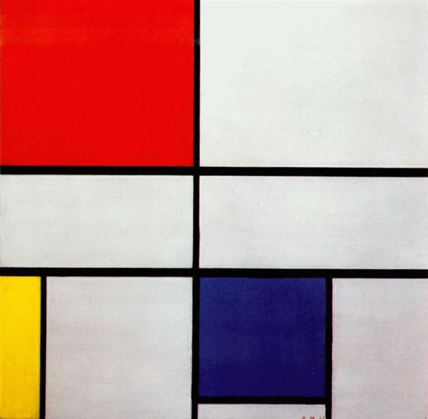
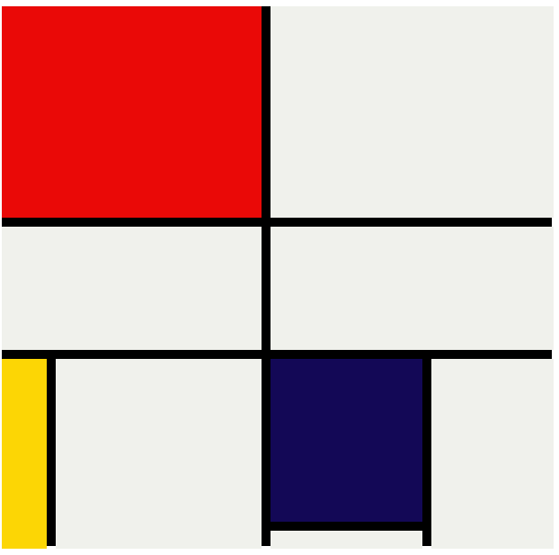

# 🎨 Mondrian Composition – CSS Project

This project recreates **Piet Mondrian’s "Composition" tableau** (with red, yellow, blue, black, and white rectangles) using only **HTML & CSS**.  
It demonstrates the use of **CSS Grid**, **Flexbox**, and **positioning** to transform abstract art into clean, semantic code.

---

## 🚀 Live Demo

👉 [View Project on GitHub Pages](halenurgurel.github.io/mondrian-composition/)

---

## 🖼️ Project Preview

| Original Artwork                                       | CSS Version                                               |
| ------------------------------------------------------ | --------------------------------------------------------- |
|  |  |

## 🛠️ Built With

- **HTML5** – semantic structure
- **CSS3** – Grid & Flexbox layout
- **Modern Normalize** – for consistent cross-browser rendering

---

## 📂 Project Structure

```

mondrian-css/
│── index.html
│── css/
│ └── styles.css
│── images/
│ ├── mondriancomposition.jpg # reference painting
│ └── vscodescreenshot.png # CSS output screenshot

```

---

## ✨ Features

- Pixel-perfect recreation of Mondrian’s **rectangular composition**
- Responsive grid: adapts to different screen sizes
- **Minimalist CSS** without any JavaScript
- Adjustable colors & sizes → experiment with new layouts!

---

## 📖 How It Works

- **Black grid lines** are built using CSS `background*color` and grid gaps
- **Colored blocks** (red, yellow, blue, white) are placed as **grid items**
- Each rectangle is given specific **width × height in px**, inspired by the original painting
- Layout can be easily modified to create other Mondrian-style artworks

---

## 🧑‍🎨 Inspiration

This project is based on **Piet Mondrian’s "Composition C, No. III, with Red, Yellow and Blue" (1935)**.
It reflects the **De Stijl** art movement: simplicity, abstraction, and harmony through primary colors and geometry.

---

## 📜 License

This project is licensed under the [MIT License](LICENSE).
Artwork reference © by Piet Mondrian (public domain).

```

```
